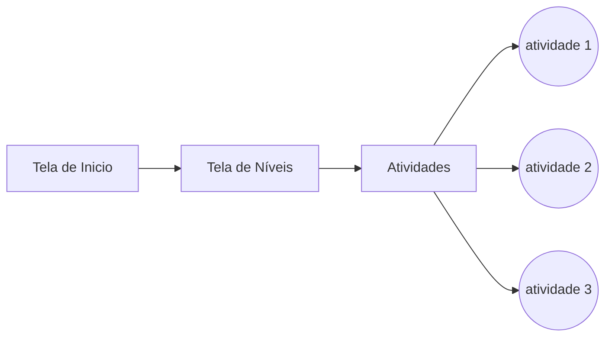

# Lea :video_game::boy::girl:

## Objetivo

> O nomedojogo tem como principal função usar a tecnologia da informação para auxiliar no processo de aprendizado e servir como ferramenta de apoio no processo de desenvolvimento, alfabetização e interação social de crianças com autismo. A aplicação será baseada e desenvolvida nas premissas do Programa de Tratamento e Educação para Autistas e Crianças com Déficits relacionados com a Comunicação (**TEACCH**) um programa mundialmente utilizado no processo de alfabetização de crianças com transtorno de desenvolvimento e também disponibilizará de uma interface auto explicativa.

> Mais informações sobre o  **TEACCH**  [aqui](http://http://www.universoautista.com.br/autismo/modules/works/item.php?id=8).

## Objetivos específicos

>Interação social, expressão afetiva, desenvolvimento da linguagem, desenvolvimento cognitivo, desenvolvimento de atividades motoras, estimular o raciocínio, desenvolver habilidades, estimular a construção de novos conhecimentos, ensinar a lidar com resultados.

## Enredo

>No jogo estarão disponíveis níveis de dificuldades e cada nível disponibilizará de atividades divertidas. Nos primeiros níveis serão atividades com imagens simples para evitar a distração da criança. Nos níveis seguintes serão atividades que requisitaram um nível maior de raciocínio e concentração de acordo com o método teacch. As atividades abordarão para aprendizagem e desenvolvimento o uso de cores, formas, objetos, brinquedos, números, letras, mini jogo da memória, mini quebra-cabeça, sílabas (formando pequenas palavras), reconhecimento de emoções, alimentos, partes do corpo, interação social, trabalhar na questão da rotina como vestir peças de roupas e também atividades do dia a dia como escovar os dentes, tomar banho, organizar seus brinquedos, etc

## Diagrama de navegação

- **Tela de Incio**
	+  Avatar/mascote do jogo (elementos azuis)
	
	+	 Botão de configurações
	
	 audio: on/off, idioma, redes sociais, sobre	
	
    + Botão de Play

- **Tela seleção de nível**
	+  Tela com os níveis de dificuldade com indicador de estrelas obtidas 
	
	+	 Botão de configurações padrão
	
   + Botão home/voltar para voltar tela de início
   
   + Botão sobre com explicação sobre cada nível

- **Tela de atividades**
	+  Atividades disponíveis para o nível com indicador de estrelas de cada fase
	
	+	 A cada atividade inicializada será disponibilizado um "tutorial" ou caixinha com explicação
	 
   + Botão de configurações no canto superior-direito da tela para com botões de voltar ao jogo ou para a tela de atividades e botão de restart

	+ Ao finalizar a atividade, mostrar tela com "Parabéns", indicativo de pontuação de acordo com as regras, botão de voltar para tela de níveis, restart e próxima atividade a ser realizada

## Sistema de vidas

>O jogo não terá sistemas de vidas, ou seja, a criança poderá tentar quantas vezes forem necessário para o aprendizado e fixação da atividade :heart:.

## Sistema de pontos

>Cada atividade terá pontuação de no máximo três estrelas de acordo com o tempo demorado para realizar a atividade ou número de tentativas realizadas. Na tela de seleção de níveis terá um indicador de quantas estrelas foram obtidas

## Fim de jogo

>O jogo acaba quando quando todas as atividades de todos os níveis estiverem completas com a pontuação máxima.

## UML 

